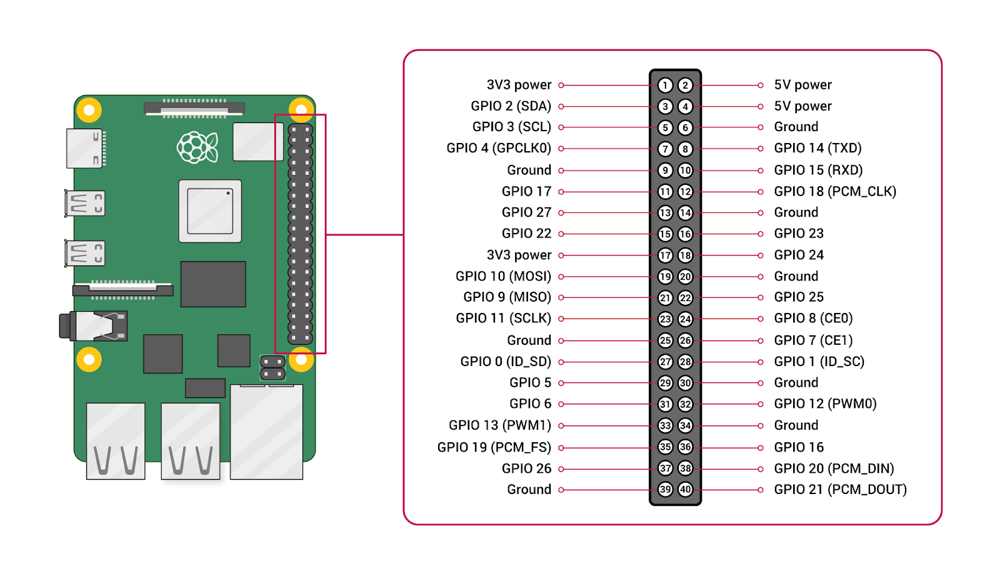
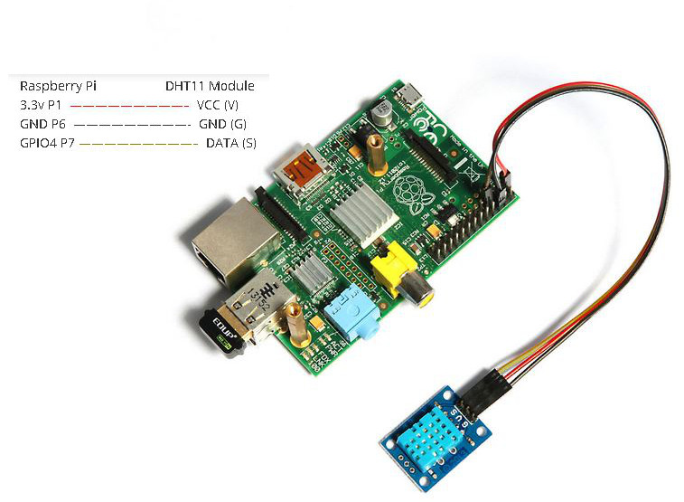

# GPIO y sensores: introducción a Raspberry Pi

> Material de apoyo para la clase 1. Los ejemplos básicos usan **RPi.GPIO**.

## Tabla de Contenidos

- [GPIO y sensores: introducción a Raspberry Pi](#gpio-y-sensores-introducción-a-raspberry-pi)
  - [Tabla de Contenidos](#tabla-de-contenidos)
  - [1. Concepto de GPIO](#1-concepto-de-gpio)
    - [Características típicas en Raspberry Pi](#características-típicas-en-raspberry-pi)
  - [2. Seguridad eléctrica básica](#2-seguridad-eléctrica-básica)
  - [3. Numeración de pines (BCM vs BOARD)](#3-numeración-de-pines-bcm-vs-board)
  - [4. Modos de GPIO (INPUT/OUTPUT, Pull-up/Pull-down, PWM)](#4-modos-de-gpio-inputoutput-pull-uppull-down-pwm)
    - [4.1 Entrada (INPUT)](#41-entrada-input)
    - [4.2 Salida (OUTPUT)](#42-salida-output)
    - [4.3 Pull-up / Pull-down](#43-pull-up--pull-down)
    - [4.4 PWM (modulación por ancho de pulso)](#44-pwm-modulación-por-ancho-de-pulso)
  - [5. Diagrama de pines](#5-diagrama-de-pines)
  - [6. RPi.GPIO (principal)](#6-rpigpio-principal)
    - [6.1 Instalación](#61-instalación)
    - [6.2 Configuración inicial](#62-configuración-inicial)
    - [6.3 Operaciones básicas](#63-operaciones-básicas)
    - [6.4 Limpieza final](#64-limpieza-final)
  - [7. gpiozero: una alternativa](#7-gpiozero-una-alternativa)
  - [8. Comparación rápida RPi.GPIO vs gpiozero](#8-comparación-rápida-rpigpio-vs-gpiozero)
  - [9. Sensor DHT11/DHT22 (lectura digital)](#9-sensor-dht11dht22-lectura-digital)
    - [9.1 Comparativa rápida](#91-comparativa-rápida)
    - [9.2 Conexión física](#92-conexión-física)
    - [9.3 Librerías para el DHT](#93-librerías-para-el-dht)
    - [9.4 Código de ejemplo](#94-código-de-ejemplo)
  - [10. Buenas prácticas](#10-buenas-prácticas)
  - [11. Recursos adicionales](#11-recursos-adicionales)

---

## 1. Concepto de GPIO

Los **GPIO** (*General Purpose Input/Output*) son pines programables que permiten a la Raspberry Pi recibir señales y controlar dispositivos externos:

- **Entrada**: leer señales de sensores o botones.
- **Salida**: controlar LED, relés, motores o zumbadores.

### Características típicas en Raspberry Pi

- El conector de los modelos recientes tiene **40 pines**.
- Los GPIO trabajan a **3.3 V**; no admiten 5 V directamente.
- No conviene superar 16 mA por GPIO ni unos 50 mA en total.
- Algunos pines también ofrecen I2C, SPI y UART.

---

## 2. Seguridad eléctrica básica

- No conectes **5 V** directamente a un GPIO: puede dañar la placa.
- Coloca una resistencia en serie con cada LED; normalmente se usa un valor entre 220 Ω y 1 kΩ, según el circuito.
- Los relés y motores requieren una etapa de potencia, como un transistor o un módulo controlador. No los conectes directamente al GPIO.
- Antes de energizar el circuito, comprueba el pinout y el cableado.

---

## 3. Numeración de pines (BCM vs BOARD)

Hay dos formas de referirse a los pines:

- **BCM**: número del GPIO interno (recomendado para documentación técnica).
- **BOARD**: número físico del pin en el conector.

En este documento se usa **BCM**. Lo importante es elegir un sistema y mantenerlo en todo el programa.


---

## 4. Modos de GPIO (INPUT/OUTPUT, Pull-up/Pull-down, PWM)

### 4.1 Entrada (INPUT)

- El pin se configura para leer un nivel lógico: `HIGH` o `LOW`.
- Una resistencia *pull-up* o *pull-down* evita que el pin quede flotante cuando no hay señal.

```python
GPIO.setup(17, GPIO.IN, pull_up_down=GPIO.PUD_UP)
```

### 4.2 Salida (OUTPUT)

- El pin entrega un nivel lógico: `HIGH` (3.3 V) o `LOW` (0 V).

```python
GPIO.setup(18, GPIO.OUT)
GPIO.output(18, GPIO.HIGH)
```

### 4.3 Pull-up / Pull-down

- **Pull-up**: el pin lee `HIGH` por defecto; pasa a `LOW` cuando un botón lo conecta a GND.
- **Pull-down**: el pin lee `LOW` por defecto; pasa a `HIGH` cuando un botón lo conecta a 3.3 V.

```python
GPIO.setup(17, GPIO.IN, pull_up_down=GPIO.PUD_DOWN)
```

### 4.4 PWM (modulación por ancho de pulso)

- PWM no genera un voltaje analógico real: alterna entre `HIGH` y `LOW` muy rápido. Al variar el porcentaje de tiempo en `HIGH` (ciclo de trabajo), permite regular el brillo de un LED o la velocidad de un motor mediante su controlador.

```python
GPIO.setup(18, GPIO.OUT)
pwm = GPIO.PWM(18, 1000)  # 1000 Hz
pwm.start(50)             # 50% de duty
pwm.ChangeDutyCycle(80)
```

---

## 5. Diagrama de pines



---

## 6. RPi.GPIO (principal)

Antes de instalar paquetes, prepara el entorno del proyecto siguiendo la guía [Preparar un entorno Python con pip o uv](./preparar%20entorno%20Python.md). Los comandos de esta sección se ejecutan con el entorno activo.

### 6.1 Instalación

```bash
python -m pip install RPi.GPIO
```

> En algunas instalaciones de Raspberry Pi OS ya está disponible. Si el comando falla, instálala dentro del entorno virtual.

### 6.2 Configuración inicial

```python
import RPi.GPIO as GPIO

GPIO.setmode(GPIO.BCM)
GPIO.setwarnings(False)   # Opcional
```

### 6.3 Operaciones básicas

```python
# Salida
GPIO.setup(18, GPIO.OUT)
GPIO.output(18, GPIO.HIGH)
GPIO.output(18, GPIO.LOW)

# Entrada con pull-up
GPIO.setup(17, GPIO.IN, pull_up_down=GPIO.PUD_UP)
if GPIO.input(17) == GPIO.LOW:
    print("Botón presionado")
```

### 6.4 Limpieza final

```python
GPIO.cleanup()
```

Llama a `GPIO.cleanup()` al terminar el programa. Libera los pines configurados y evita advertencias en la siguiente ejecución.

---

## 7. gpiozero: una alternativa

`gpiozero` ofrece objetos para componentes habituales, como `LED`, `Button` y `Motor`. Es útil para prácticas rápidas, aunque los ejemplos de esta guía usan **RPi.GPIO** para mostrar la configuración de cada pin.

Ventajas de `gpiozero`:

- Sintaxis más corta y legible.
- Limpieza automática de los recursos.
- Adecuada para prototipos y ejercicios introductorios.

Limitaciones frente a RPi.GPIO:

- Menos control fino sobre configuración de bajo nivel.
- Abstracciones que pueden ocultar detalles eléctricos importantes.

---

## 8. Comparación rápida RPi.GPIO vs gpiozero

| Aspecto | RPi.GPIO (principal) | gpiozero (mención) |
| --- | --- | --- |
| Nivel de control | Bajo nivel, detallado | Alto nivel, abstracto |
| Configuración | Manual | Automática por componente |
| PWM | Manual | Integrado |
| Limpieza | Requiere `cleanup()` | Automática |
| Curva de aprendizaje | Media | Baja |
| Uso habitual | Control preciso del hardware | Prácticas y prototipos rápidos |

---

## 9. Sensor DHT11/DHT22 (lectura digital)

### 9.1 Comparativa rápida

| Parámetro | DHT11 | DHT22 |
| --- | --- | --- |
| Rango de temperatura | 0–50 °C (±2 °C) | -40–80 °C (±0.5 °C) |
| Rango de humedad | 20–80 % (±5 %) | 0–100 % (±2 %) |
| Intervalo mínimo entre lecturas | 1 s | 2 s |
| Consumo | 0.5–2.5 mA | 1–1.5 mA |
| Precio | Bajo | Moderado |

### 9.2 Conexión física

```
VCC  -> 3.3V
DATA -> GPIO4 (Pin 7)
NC   -> No conectar (si el sensor tiene cuatro pines)
GND  -> GND
```

> En un DHT suelto, coloca una resistencia *pull-up* de 4.7 kΩ a 10 kΩ entre VCC y DATA. Los módulos de tres pines normalmente ya la incluyen.



La imagen muestra un módulo DHT11 de tres pines: VCC va a 3.3 V (pin físico 1), GND al pin físico 6 y DATA a GPIO4 (pin físico 7). No conectes VCC a 5 V.

### 9.3 Librerías para el DHT

La biblioteca `adafruit-circuitpython-dht` usa su propio acceso al GPIO; no se mezcla con `RPi.GPIO` en el mismo ejemplo.

```bash
python -m pip install adafruit-circuitpython-dht
sudo apt-get install libgpiod2
```

### 9.4 Código de ejemplo

```python
import time
import board
import adafruit_dht

sensor = adafruit_dht.DHT11(board.D4)  # GPIO4

try:
    while True:
        try:
            temp_c = sensor.temperature
            hum = sensor.humidity
            print(f"Temperatura: {temp_c:.1f} °C | Humedad: {hum:.1f}%")
        except RuntimeError as error:
            print(f"Lectura fallida: {error}")
        time.sleep(2.0)
finally:
    sensor.exit()
```

---

## 10. Buenas prácticas

- Comprueba el pinout antes de conectar la alimentación.
- Usa *pull-up* o *pull-down* en las entradas para evitar lecturas inestables.
- No controles el mismo pin con dos bibliotecas diferentes dentro del mismo programa.
- Respeta el intervalo mínimo de cada sensor; el DHT22 requiere al menos dos segundos entre lecturas.
- Guarda un diagrama o una fotografía del cableado para poder revisarlo después.

---

## 11. Recursos adicionales

- [Documentación de gpiozero](https://gpiozero.readthedocs.io/)
- [Documentación de RPi.GPIO](https://sourceforge.net/p/raspberry-gpio-python/wiki/Home/)
- [Documentación de Raspberry Pi](https://www.raspberrypi.com/documentation/)
